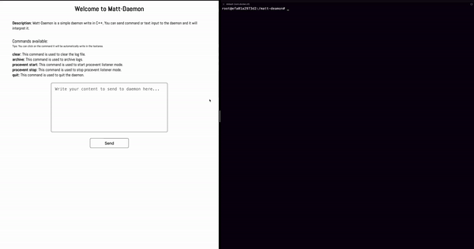

<div align="center">
  <picture>
    <source media="(prefers-color-scheme: dark)" srcset="assets/dark.svg">
    <source media="(prefers-color-scheme: light)" srcset="assets/light.svg">
    
  </picture>
</div>

## Description

Matt-daemon is a lightweight application that operates silently in the background, continuously monitoring a designated port for incoming messages. It provides a seamless solution for processing and managing various types of messages in real-time.

## Key Features

- Message Reception: The daemon establishes a connection to the specified port and listens for incoming messages, ensuring a smooth flow of communication and log it to a file.
- Message Processing: Once received, the daemon efficiently processes each message. There is a operation that is allowed:
  - archive
  - quit
  - clear
  - procevent start, procevent stop
- Encryption communication: The daemon uses AES-128 encryption to ensure secure communication between the client and server.
- Error Handling: The daemon includes robust error handling mechanisms to gracefully handle any unexpected situations or exceptions that may arise during message processing.


## Usage

```
./Matt_daemon -h
Usage : ./Matt_daemon
[-c/--client MAX_ACCEPTED_CONN]. 1 <= MAX_ACCEPTED_CONN <= 100.
[-k/--key KEY]. KEY path for aes encryption.
[-p/--procevent] Enable linux kernel process event connection.
```

## Scripts

Multiples scripts are available to help you to use the project.

- [./scripts/log.sh](https://github.com/owalid/matt-daemon/tree/main/scripts/log.sh) is used to display the log file.
- [./scripts/send_content <CONTENT>](https://github.com/owalid/matt-daemon/tree/main/scripts/send_content) is used to send a message to the daemon.
- [./scripts/encypted_command/send_encrypted_content.py](https://github.com/owalid/matt-daemon/tree/main/scripts/encypted_command/send_encrypted_content.py) is used to send an encrypted message to the daemon.

The Makefile are also script that you can use to build the project, install the project, run the project and clean the project.

- `make` to build the project.
- `make install` to download dependencies.
- `make test` to run tests.

## Web



